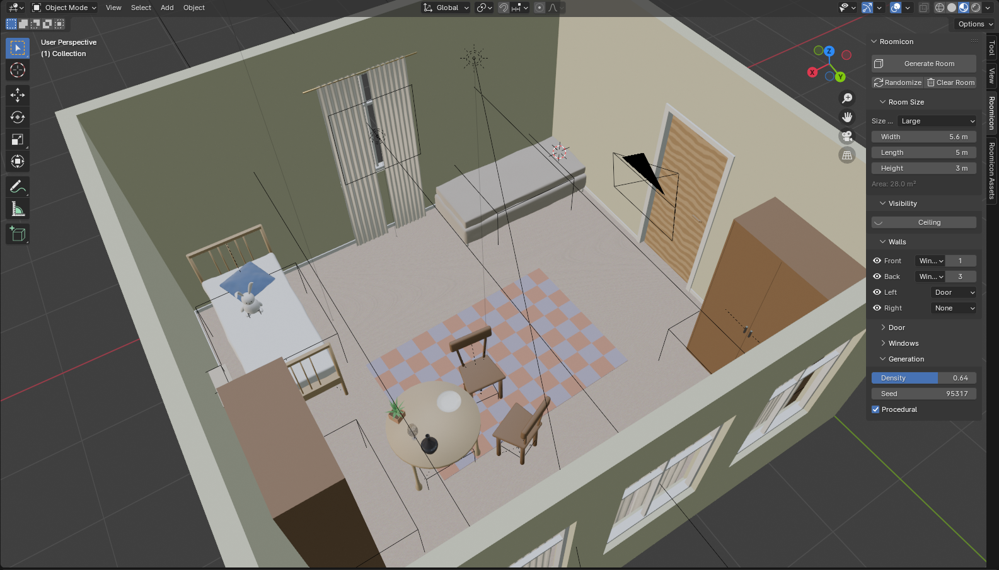
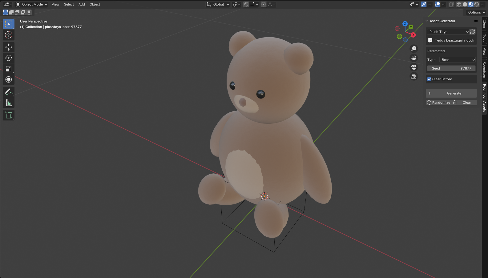
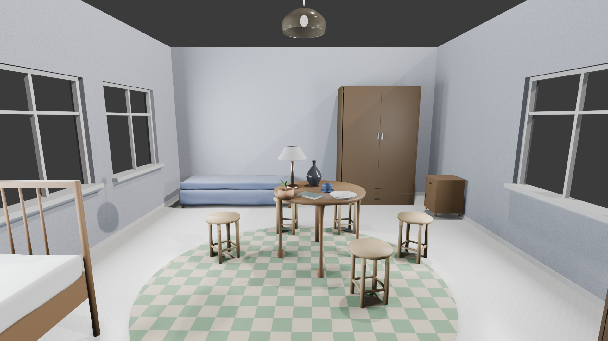
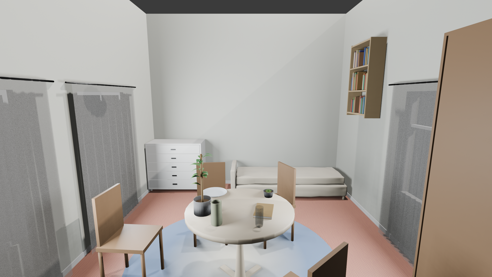
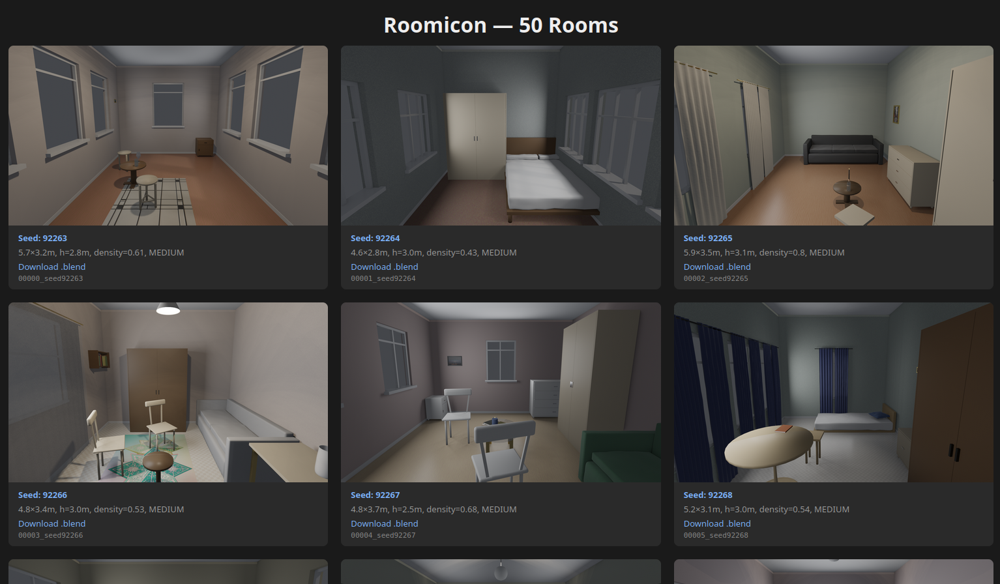

# Roomicon — Blender Interior Plugin

Плагин для Blender 4.0, генерирующий интерьеры комнат: геометрию помещения, расстановку мебели и декора, применение материалов.

Генерируйте готовые интерьеры в один клик — как заготовку для архитектурной визуализации, быстрые фоны для визуальных новелл и анимаций, или чтобы автоматизировать рутинную часть моделирования и сосредоточиться на творческих деталях.







## Возможности

- Прямоугольная комната с настраиваемыми размерами (ширина, длина, высота)
- Оконные рамы (настраиваемые: количество камер, высота горизонтальной планки)
- Процедурные материалы: полы (паркет, плитка, ламинат), стены (штукатурка, краска, обои), двери, плинтусы — с возможностью запечь в .blend
- Мебель: столы (8 типов), стулья (6 типов), кровати и диваны (6 типов), шкафы, тумбочки, комоды
- Декор: посуда, лампы, часы, полки, картины, фоторамки, ковры, подушки, шторы, зеркала, книги, растения, свечи, мягкие игрушки
- Режим **Procedural** — генерация мебели и декора на лету (без предварительных .blend)
- Стулья автоматически расставляются вокруг столов
- Автоматические шторы на окнах, ковры, подушки и игрушки на кроватях, книги на полках
- Картины, фоторамки и ковры используют процедурные паттерны по умолчанию; по желанию можно подложить свои изображения в `assets/pool/pictures/`, `assets/pool/photoframes/` или `assets/pool/rugs/`
- Автоматическая расстановка с учётом границ комнаты, коллизий и логики размещения
- Пресеты площади: Small / Medium / Large / XLarge для **Randomize**
- Параметры **Density** и **Seed** для контроля плотности и воспроизводимости
- Переключатели видимости потолка и каждой стены

## Установка

1. Скачать или клонировать репозиторий, затем:
   - Скопировать папку `roomicon/` в директорию аддонов Blender, или
   - Запаковать в .zip и установить через **Edit > Preferences > Add-ons > Install**

2. Активировать аддон **Roomicon** в списке.

3. (Опционально) Сгенерировать .blend ассеты:
   ```
   blender --background --python tools/generate_assets.py
   blender --background --python tools/generate_materials.py
   ```
   Без этого шага плагин будет использовать процедурную генерацию (fallback).

## Использование

1. Открыть боковую панель (N) в 3D Viewport
2. Перейти на вкладку **Roomicon**
3. Настроить параметры (сворачиваемые секции):
   - **Room Size** — пресет площади (Small/Medium/Large/XLarge), ширина, длина, высота, площадь
   - **Visibility** — показать/скрыть потолок
   - **Walls** — тип каждой стены (None / Door / Windows), количество окон, видимость (иконка глаза)
   - **Door** ▸ — ширина и высота двери (свёрнуто по умолчанию)
   - **Windows** ▸ — ширина, высота, высота подоконника, количество камер, высота горизонтальной планки (свёрнуто по умолчанию)
   - **Generation** — density и seed
4. Нажать **Generate Room**
5. **Randomize** — случайные параметры из пресета площади + генерация
6. **Clear Room** — удалить всё сгенерированное

## Пакетная генерация

Генерация множества вариантов комнат в headless-режиме с рендером и HTML-галереей:

```bash
# 10 вариантов со случайным seed
blender --background --python tools/batch_generate.py -- --count 10

# Только большие комнаты
blender --background --python tools/batch_generate.py -- --count 10 --room-size LARGE

# С заданным начальным seed и разрешением
blender --background --python tools/batch_generate.py -- --count 20 --seed-start 100 --resolution 2560x1440

# Полный список параметров
blender --background --python tools/batch_generate.py -- --help
```

Результат в папке `output/`: PNG-рендеры, .blend файлы, `index.html` галерея для просмотра.

## Генерация ассетов

### Массовая генерация (все типы)

```bash
# По умолчанию: 5 вариантов каждого типа
blender --background --python tools/generate_assets.py

# Только столы с заданным количеством
blender --background --python tools/generate_assets.py -- --type table --count 20
```

Ассеты сохраняются в `assets/furniture/` и `assets/decor/<категория>/`.

### Индивидуальные генераторы (с превью)

Каждый генератор имеет свой скрипт с рендер-превью и HTML-галереей:

```bash
# Столы: 10 вариантов с превью
blender --background --python tools/generators/tables/generate.py -- --count 10

# Стулья: только кресла
blender --background --python tools/generators/chairs/generate.py -- --type armchair --count 5

# Лампы: сохранить как .blend ассеты
blender --background --python tools/generators/lamps/generate.py -- --count 10 --save-blend

# Все генераторы поддерживают: --type, --count, --seed, --output, --resolution, --save-blend
```

Результат: `output/<генератор>/` с PNG-рендерами и `index.html` галереей.

### Редактирование ассетов

Сгенерированные .blend файлы можно открыть в Blender, отредактировать, и генератор комнат будет использовать ваш набор. Важные правила:

- **Не удаляйте Empty-root.** Каждый ассет имеет Empty-родитель (с маркером `_asset_root`), хранящий метаданные (`surface_z`, `table_size`, `mattress_z` и др.). Не удаляйте его.
- **Сохраняйте иерархию.** Дочерние объекты должны оставаться привязаны к root Empty. Можно добавлять/удалять/изменять children, но не ломайте цепочку parent.
- **Не переименовывайте root** с другим префиксом типа. Загрузчик ищет файлы по префиксу имени (например `table_*.blend`).
- **Custom properties важны.** Если вы изменили высоту стола — обновите `surface_z` на root Empty. Если изменили высоту матраса — обновите `mattress_z`. Эти значения определяют, где размещается декор на поверхности.
- **Origin = центр основания.** Объекты должны иметь origin в центре основания (на уровне пола). Система размещения использует эту точку как опорную.
- **Направление лица = +Y.** Мебель смотрит вперёд вдоль +Y. Пристенная мебель имеет спинку вдоль +Y (к стене).

### Режим ассетов vs Процедурный режим

- **Procedural** (по умолчанию): все объекты генерируются на лету из 20 встроенных генераторов. Бесконечная вариативность через seed. Файлы .blend не нужны.
- **Asset**: объекты загружаются из .blend файлов в `assets/`. Вы контролируете, какие именно объекты появятся. Сгенерируйте набор, отберите лучшие, затем используйте для стабильного результата.

Проект полностью автономен — все .blend ассеты создаются встроенными генераторами, ничего не нужно скачивать отдельно. Оба режима используют одинаковый алгоритм размещения.

## Процедурные генераторы (20)

**Мебель:** Tables (8 типов), Chairs (6), Seating & Beds (6), Wardrobes (5, вкл. тумбочки и комоды)

**Декор:** Kitchenware, Lamps, Clocks, Shelves, Paintings, Photoframes, Rugs, Cushions, Curtains, Mirrors, Booksets, Plants, Candles, Plush Toys

## Требования

- Blender 4.0+

## Автор

[NeuroSpiritus](https://github.com/neurospiritus)

## Лицензия

GPL v3 — см. [LICENSE](LICENSE)
